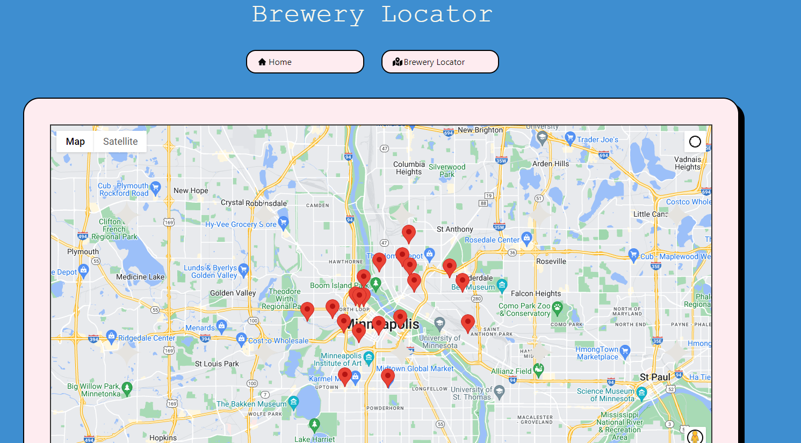

# Brewery-Finder

## Beer Randomizer and User Input

A simple JavaScript application that generates a random beer using the Punk API and stores user input of name and favorite beer.

## Description

Random beer generator that displays the beer name and description.
User input form to store name and favorite beer.
Error message for missing information in the form.
Success message for successful storage of user input.
Display of last registered user's name and favorite beer.

## Installation

No installation needed in order to use this application. Simply visit the website at the following link:

https://khepriSol.github.io/brewery-finder

## Technology Used

- HTML
- J Query
- Bulma for styling purposes
- CSS
- JavaScript
- Punk API
- Javascript maps API and Google Maps
- Local Storage

## Usage

Visit the website at the following url:
https://khepriSol.github.io/brewery-finder

Press the "Random Beer" button to generate a random beer.

Fill out the form with your name and favorite beer in order to sign our guest book

Click on the Brewery Locator button at the top center of the main page to view an interactive map that shows where local breweries are

## Notes

Make sure to have an internet connection to retrieve the data from the Punk API.
The stored information is only available in the current browser and will be lost when the browser cache is cleared.

## Credits

- El Elnimeiry
- Jane Collazo
- Jonah Kane
- Sara Schroeder

## License

[MIT](https://choosealicense.com/licenses/mit/)
